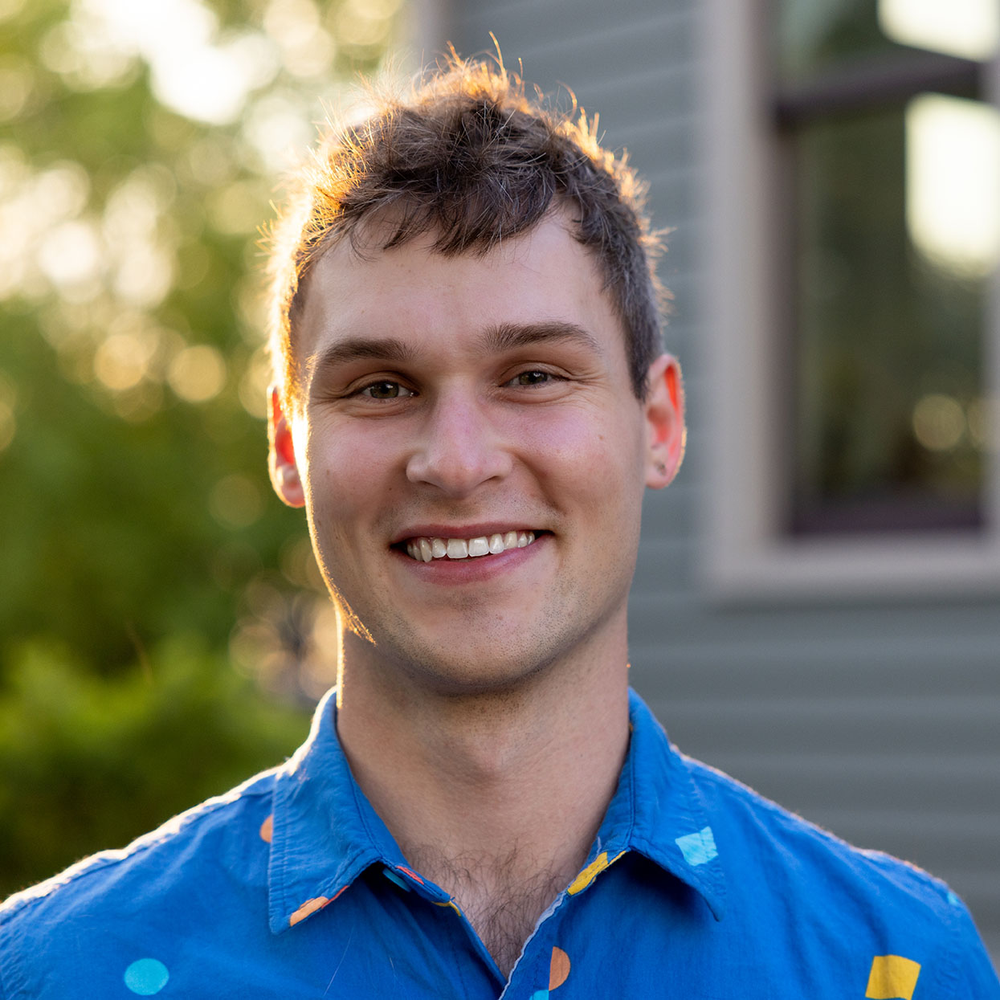
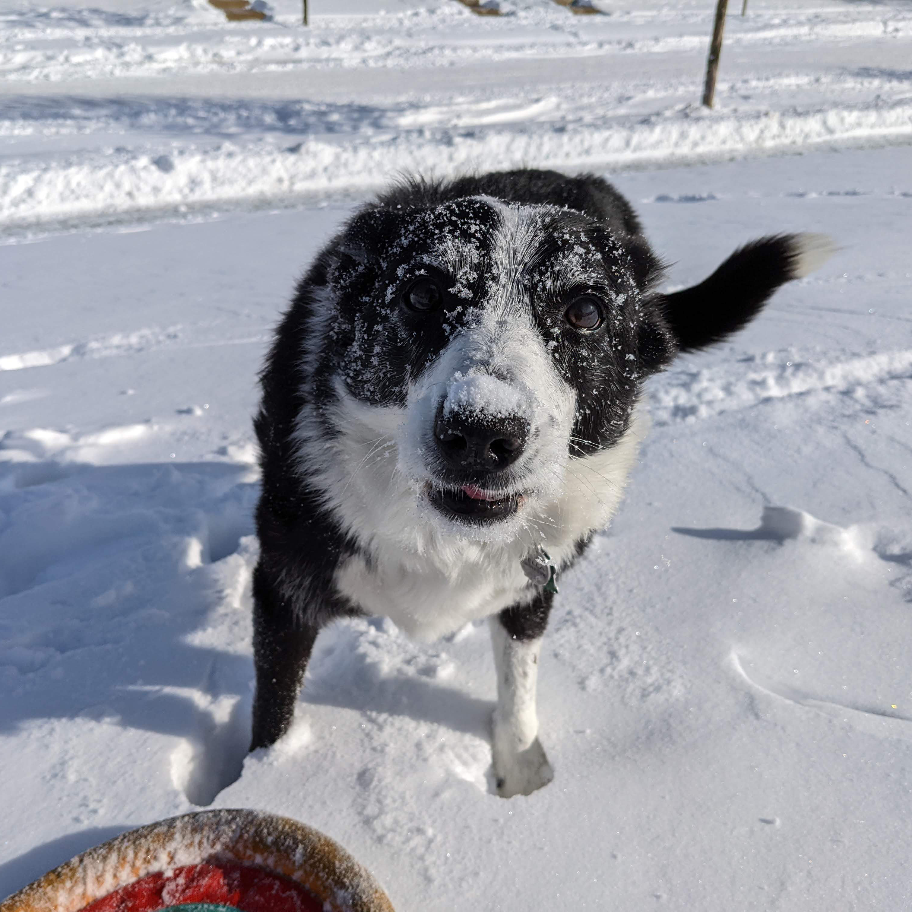

   
  

### Neal Jackson, PhD

##### I am currently a research engineer at [Blue Iris Labs](https://blueirislabs.com/), a health sensing startup founded by [Erik](https://www.linkedin.com/in/erikpage), [Will](http://wwhuang.com/), and me.

##### I was previously a:

  - **PhD student at University of California, Berkeley in EECS**
  - **Undergraduate student at University of Michigan in CSE**

  During my time at Michigan and Berkeley, I worked with Prabal Dutta and [Lab11](http://lab11.eecs.umich.edu/).
  My research is focused on developing tools and frameworks for the
  application-driven design of energy-harvesting wireless sensors.
  To this end, I developed a long-lifetime indoor sensor
  mote named [Permamote](https://github.com/lab11/permamote).
  Permamote's design was informed by a custom wireless sensor energy simulator
  that incorporates real energy harvesting traces and platform benchmarks to
  estimate system energy utilization, lifetime, and availability.
  Permamote combines energy-harvesting, a backing primary cell battery, and the
  newest, lowest power components to achieve reliable operation over a greater
  than 10 year lifetime.  Permamote performs ambient environmental sensing, but
  its heirarchical and modular power supply can be reused to serve various
  application specific designs.

  Most recently, I adapted the platform and created
  [Permacam](https://github.com/lab11/permamote/blob/master/hardware/permacam/rev_a/permacam_pcb.png)
  to support an ultra-low power, long lifetime camera for wireless, long-lifetime computer vision tasks.

   
  

### News
 - **12/2022:** I graduated! My dissertation can be found [here](publications/nsj-thesis.pdf)
 - **08/2022:** I married the beautiful and goofy [Taryn Farber](tarynfarber.art)!
 - **09/2021:** I moved back to Ann Arbor, Michigan
 - **04/2020:** Won the Outstanding Graduate Student Instructor Award for teaching EECS149 in Fall 2019
 - **02/2020:** I got a dog! Her name is Bella and she's wonderful
 - **11/2019:** I started working with Erik Page & Associates, what would later become Blue Iris Labs
 - **04/2019:** My paper [Capacity over Capacitance for Reliable Energy Harvesting Sensors](publications/jackson19capacity.pdf) appeared at IPSN'19

